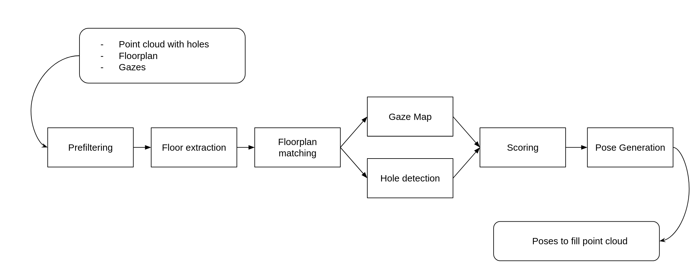

# HoleDet
## Overview
This is a project to detect holes or under sampled regions in 3D point clouds of 
indoor spaces using the following pipeline 


## Dependencies
In order to run the pipeline you need some external libraries:
- [PCL](https://pointclouds.org/downloads/) version: 1.10
- [Eigen](https://eigen.tuxfamily.org/index.php?title=Main_Page) version: 3.3
- [OpenCV](https://opencv.org/releases/) version: 4.2
- [Pkg-Config](https://www.freedesktop.org/wiki/Software/pkg-config/) version: 0.29.1 (should be preinstalled)

## Data
You need the following data in order to run the pipeline:
- A [pcd](https://pointclouds.org/documentation/tutorials/pcd_file_format.html) file of the indoor space
in which you want to search for holes. (e.g. hololens.pcd)
- An image of the floor plan of your indoor space (e.g. floorplan.jpg)
- or a pcd file containing the vertices of your floor plan which are aligned to the main space (e.g. floorplan.pcd)
- (optional) A pcd file of each 3d point where data was collected (e.g. trajectory.pcd)
- (optional) An [obj](https://en.wikipedia.org/wiki/Wavefront_.obj_file) file containing the heading of 
each data collection point (e.g. gaze_directions.obj) 
- (optional) A text file containing the length of each coherent trajectory in trajectory.pcd
(e.g. trajectory_lengths.txt)

## Quickstart guide
Download the [example data](https://drive.google.com/drive/folders/12w7HHLvwecHy12qnrM2um-8PaWJ3Vupf?usp=sharing) 
and copy it into the data folder then execute 
(at the moment it is not possible to use the pipeline in Release mode because some external 
libraries used will behave different):
```commandline
mkdir build
cd build
cmake .. -DCMAKE_BUILD_TYPE=Debug
make -j 6
./HoleDet
```

### Create Floor plan pcd
First the floor plan jpg is opened. Here you can click on all corners of your indoor space. It is very important that 
you remember in which order you click them. If you have clicked them all close the picture with the `esc` button 
(do not just close the window). \
Next the projected point cloud of the floor plane is opened. Here you have to hold `shift` and click on the same 
corners (in the same order as before). After you have finished do not just close window but just hold `shift` again 
and click anywhere. Unfortunately the viewer cannot be closed in a different way, which is a known PCL 
[issue](https://github.com/PointCloudLibrary/pcl/issues/3959). A first transformation based on your selection of corners 
is then applied. This is then refined using Ransac. This point cloud is then saved, so you do not have to do this step 
again (remember to change the parameter).

### Output
The pipeline generates multiple outputs files in the `output/` directory. First there is an overview 
file which shows for each hole:
- The coordinates the centroid
- The number of boundary point
- The area
- The score

Furthermore, for each hole there is a file generated in `output/poses` containing 
the computed poses to resample the hole. The poses are saved as row major flattened matrices. 
Before rerunning the pipeline you should delete all the files from the output folder (but not the folder).

## Constants and Parameters
The pipeline uses a lot of parameters. These can be found and changed in the `cfg/config.yaml` file.
- *use_existing_floorplan* 
: This should be true if you already have a pcd file of your floor plan. If this is false the pipeline will create it 
for the next use
- *use_gaze*
: True if you want to use the optional gaze and trajectory data. This makes the pipeline a lot slower
- *input* 
: The path to all the inputs file. If you use the example data this should not change
- *poisson_depth*
: The depth of the poisson reconstruction of the mesh
- *normal_search_radius*
: The search radius used for the normal estimation
- *outlier_radius*
: Max radius of the radial outlier removal used for pre-filtering of the point cloud
- *outlier_min_neighbours*
: The minimum neighbours needed to be an inlier in the outlier removal
- *image_resolution* 
: The resolution of the floor plan image in *m/px*. This is only needed if *use_existing_floorplan* is false
- *max_iteration* 
: Maximum number of Ransac iterations used to match the floor plan to the original space
- *max_translation* 
: Maximum translation in *m* used to translate the floor plan in the ransac step
- *max_angle*
: Maximum angle in *deg* used to rotate the floor plan in the ransac step
- *boundary_search_radius* 
: The max search radius used for boundary estimation
- *angle_tresh* 
: An angle threshold in *rad* which is used in clustering. Only boundary points with an angle between the normals 
smaller than this threshold can belong to the same cluster
- *vert_score_threshold* 
: The max covariance in height of the points inside a point cloud. If it is higher than this threshold the score 
will be penalised.
- *min_score*
: The minimum score a hole has to have to be written out and visualized